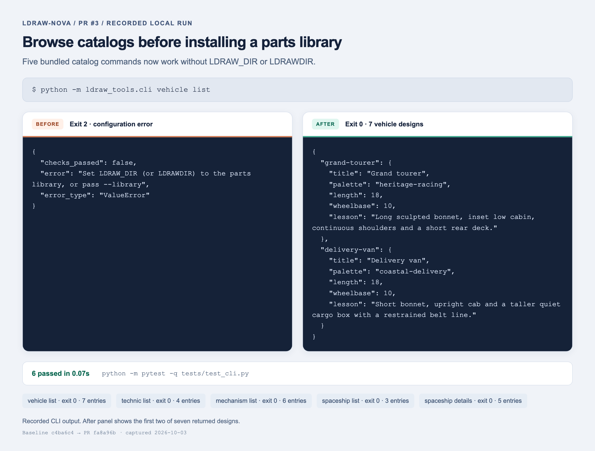
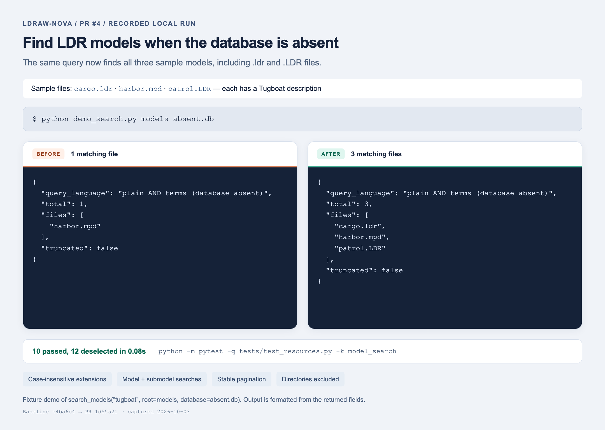
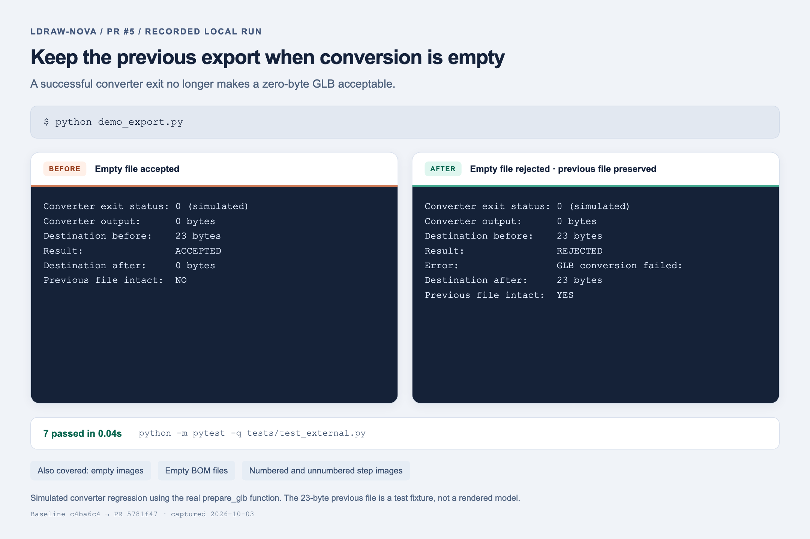

# PR screenshots

Before/after screenshots of locally recorded results for draft PRs #3, #4 and #5. These are browser screenshots of formatted command transcripts, rather than screenshots of the web application.

| PR | Before | After |
| --- | --- | --- |
| #3 | Bundled vehicle catalog fails without library configuration | All five supported catalog commands work; the vehicle catalog returns seven designs |
| #4 | Fallback search finds only `harbor.mpd` | Also finds `cargo.ldr` and `patrol.LDR` |
| #5 | A simulated converter's zero-byte output replaces a previous file | Empty output is rejected and the previous fixture file remains intact |

Baseline: `c4ba6c4913e0975ee7e34e647c26129137657d5e` (fork master).

PR heads tested:
- #3: `fa8a96b51d06bc2a077140ccb8c803dcad8c629c`
- #4: `1d55521d761778bd0679fa84a4db21e40d41171a`
- #5: `5781f47860fcfc05aeafa9abeae482bddb6c39c4`

`recorded-results.json` contains captured stdout, exit statuses, and targeted test results. The PR #3 screenshot displays only the first two vehicle designs. PR #4 displays selected fields from the actual API return value. PR #5 uses the real `prepare_glb` function with a simulated converter; its 23-byte prior output is a sentinel fixture, not a valid model.

To reproduce in a checkout with its Python dependencies installed:

1. For #3, unset `LDRAW_DIR`, `LDRAWDIR`, and `LDRAW_SHADOW`, then run `python -m ldraw_tools.cli vehicle list`.
2. For #4, create a `models/` directory with `cargo.ldr`, `harbor.mpd`, and `patrol.LDR`. Write `0 Tugboat` to each file, then run `python docs/pr-screenshots/demo_search.py models absent.db`. Ensure `absent.db` does not exist.
3. For #5, run `python docs/pr-screenshots/demo_export.py`.

Run each demo against the baseline checkout and its PR head to compare. Captured on 2026-10-03.
